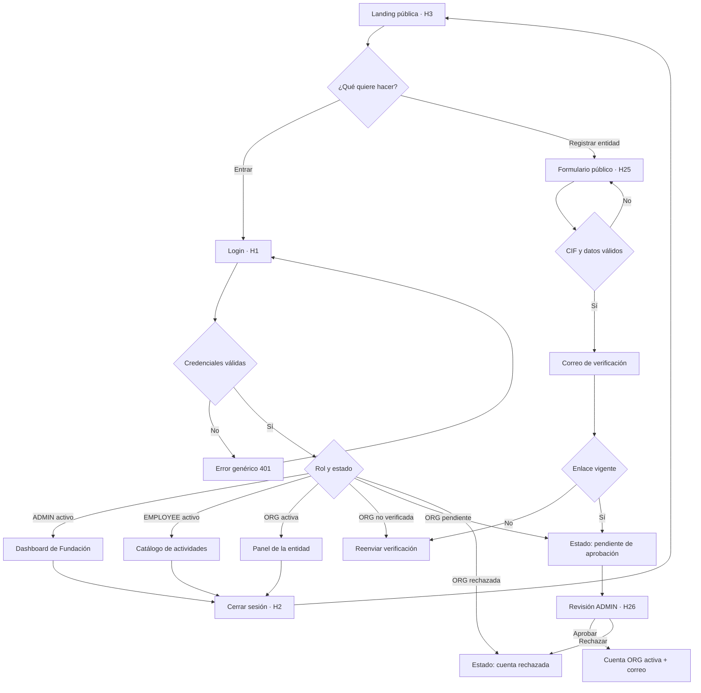
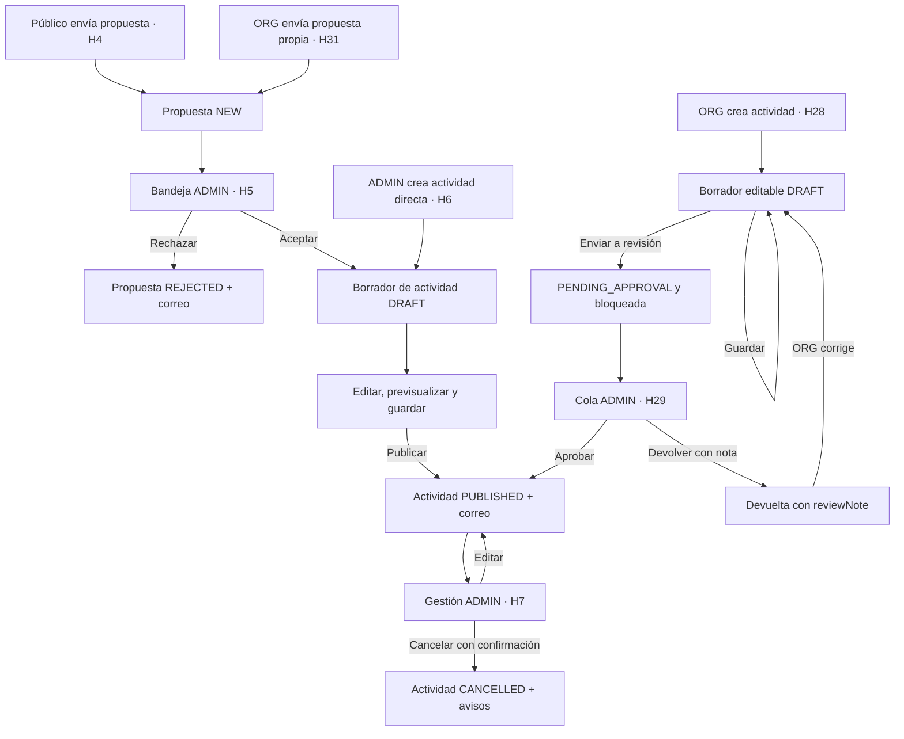
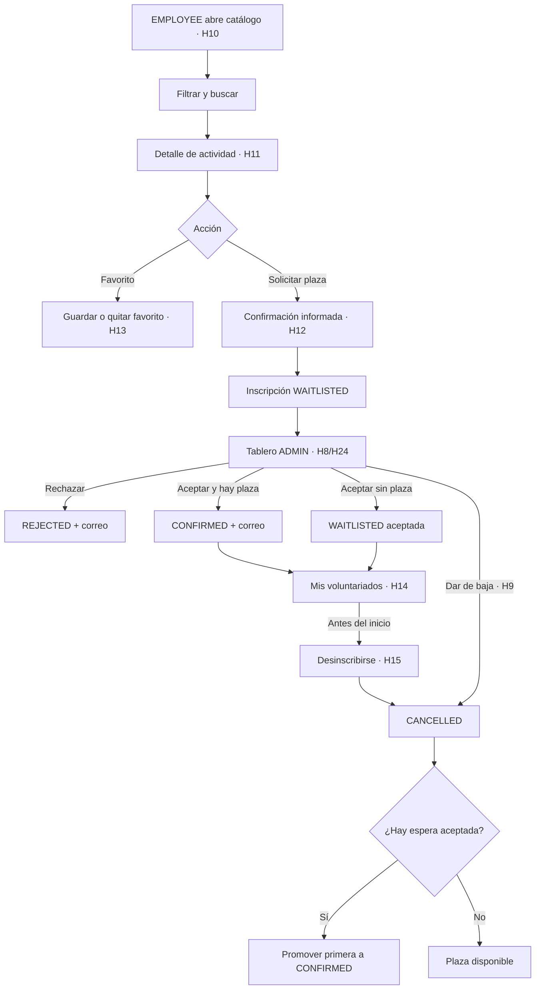
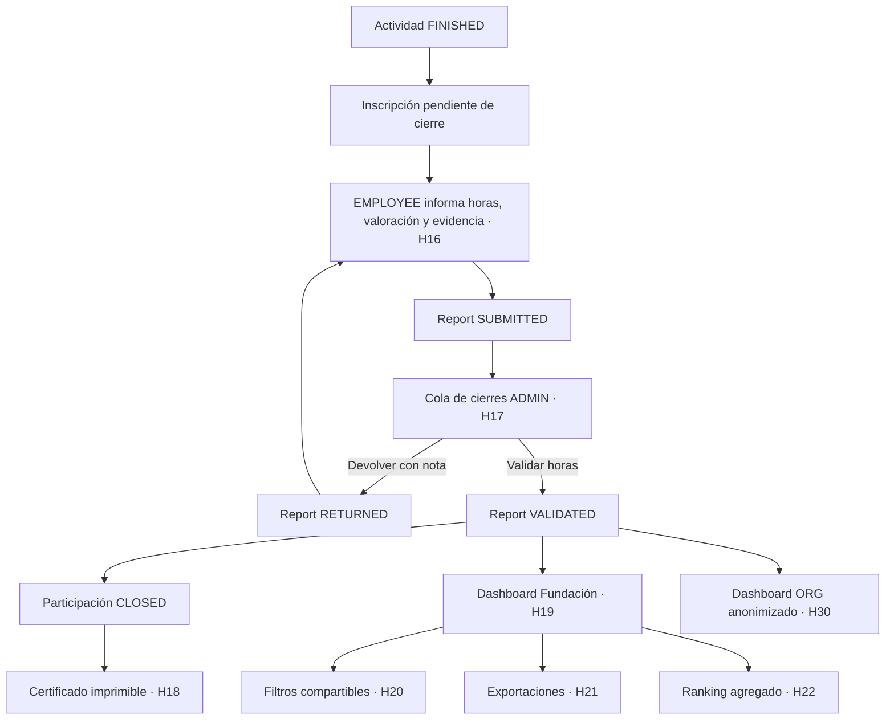
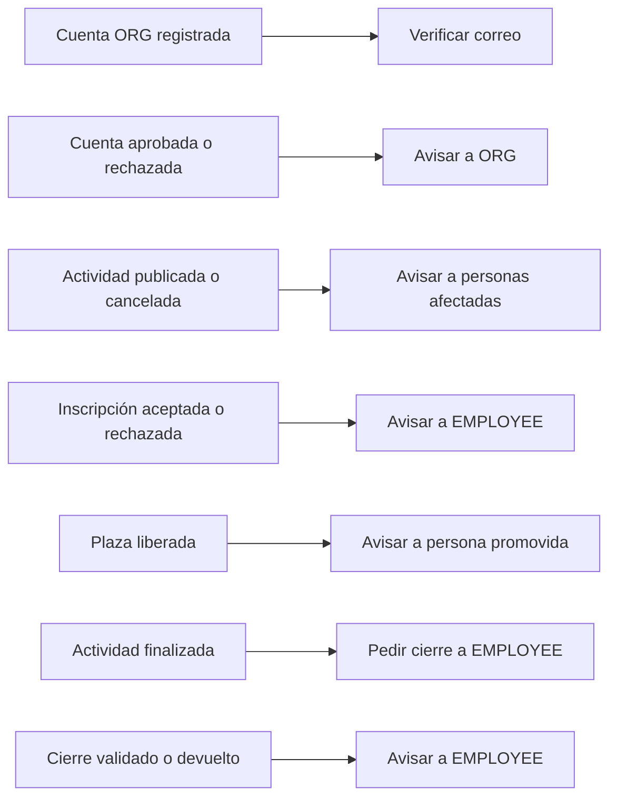

# Userflows del MVP — modelo definitivo de tres roles

**Versión:** 03/09/2026  
**Perfiles:** público, `EMPLOYEE`, `ADMIN` y `ORG`  
**Alcance:** historias H1–H31

Este documento sustituye cualquier flujo anterior basado en dos roles. La organización social dispone del perfil autenticado `ORG`, pero nunca accede a datos personales o a horas individuales de empleados.

## Fuentes de verdad

- [Contrato canónico de API y estados](https://github.com/Proyecto-Fundacion-Verisure/backend/issues/117)
- [Backlog funcional y técnico](https://github.com/orgs/Proyecto-Fundacion-Verisure/projects/2)
- [Tarea de actualización de userflows](https://github.com/Proyecto-Fundacion-Verisure/documentacion-po/issues/4)

## 1. Acceso, sesión y alta de una entidad

Reglas clave:

- Una sesión válida se dirige según rol; una cuenta ORG no activa conserva la sesión solo para mostrar su estado.
- Si el CIF ya pertenece a una entidad activa, aprobar añade la nueva persona a esa entidad. Rechazarla no desactiva la entidad ni sus otras cuentas.
- El cierre de sesión limpia token, usuario y cabecera de autenticación en el cliente.

## 2. Propuestas y ciclo de una actividad

Reglas clave:

- Solo ADMIN publica en el catálogo.
- Una actividad enviada por ORG deja de ser editable hasta que ADMIN la aprueba o devuelve.
- La nota de devolución permanece visible sobre el formulario de ORG.

## 3. Participación del empleado

Reglas clave:

- Aceptar una inscripción sin aforo conserva la cola con `accepted=true`; no falla por actividad completa.
- La persona ve su posición en espera, pero no datos de otras personas.
- La baja deja de estar disponible cuando comienza la actividad.

## 4. Cierre, certificado y analítica

Reglas clave:

- Solo existe un cierre por inscripción; reenviar uno devuelto actualiza el existente.
- La entidad ve métricas agregadas, nunca nombres, correos, departamentos ni horas individuales.
- Cada gráfico dispone de una tabla equivalente accesible.

## 5. Avisos por correo

Los avisos de H23 son efectos secundarios: no sustituyen el estado visible dentro de la plataforma ni bloquean la operación principal.

## Matriz de rastreabilidad

| Historia | Perfil principal | Paso cubierto |
|---|---|---|
| H1 | Todos | Login, sesión, rutas protegidas y redirección por rol |
| H2 | Todos | Menú de usuario y logout |
| H3 | Público | Landing, misión, cifras y líneas de acción |
| H4 | Público | Envío de propuesta sin cuenta |
| H5 | ADMIN | Revisar, aceptar o rechazar propuesta |
| H6 | ADMIN | Crear, guardar y publicar actividad |
| H7 | ADMIN | Listar, editar y cancelar actividad |
| H8 | ADMIN | Consultar inscripciones, aforo y contadores |
| H9 | ADMIN | Dar de baja y promover desde la lista de espera |
| H10 | EMPLOYEE | Explorar y filtrar catálogo |
| H11 | EMPLOYEE | Consultar detalle de actividad |
| H12 | EMPLOYEE | Solicitar plaza con confirmación |
| H13 | EMPLOYEE | Añadir o quitar favoritos |
| H14 | EMPLOYEE | Consultar voluntariados activos y cerrados |
| H15 | EMPLOYEE | Cancelar la propia inscripción antes del inicio |
| H16 | EMPLOYEE | Crear o corregir el cierre de participación |
| H17 | ADMIN | Validar o devolver cierres |
| H18 | EMPLOYEE | Consultar e imprimir certificado |
| H19 | ADMIN | Consultar KPI y gráficos agregados |
| H20 | ADMIN | Filtrar dashboard y compartir vista |
| H21 | ADMIN | Exportar datos e informes |
| H22 | ADMIN | Consultar ranking agregado |
| H23 | Todos | Recibir los siete grupos de avisos por correo |
| H24 | ADMIN | Aceptar o rechazar inscripciones |
| H25 | ORG | Registrar cuenta, verificar correo y consultar estado |
| H26 | ADMIN | Aprobar o rechazar cuentas ORG |
| H27 | ORG | Consultar panel de actividades y propuestas propias |
| H28 | ORG | Crear borrador y enviar actividad a revisión |
| H29 | ADMIN | Aprobar o devolver actividades de ORG |
| H30 | ORG | Consultar impacto agregado y anonimizado |
| H31 | ORG | Crear y consultar propuestas propias |

## Validación de consistencia

- Los flujos usan `Registration`, `Report`, `Proposal` y `Partner`, sin términos obsoletos como `Enrollment`.
- Se representan los estados de cuenta `PENDING_VERIFICATION`, `PENDING_APPROVAL`, `ACTIVE` y `REJECTED`.
- Se representa `PENDING_APPROVAL` dentro del ciclo de actividad de ORG.
- Las rutas de ORG obtienen la entidad desde la sesión; el flujo no solicita `partnerId` al usuario.
- La matriz cubre H1–H31 sin conservar el modelo anterior de dos roles.

## Revisión

El artefacto requiere aprobación de al menos otra persona del equipo antes de cerrar la tarea #4.

